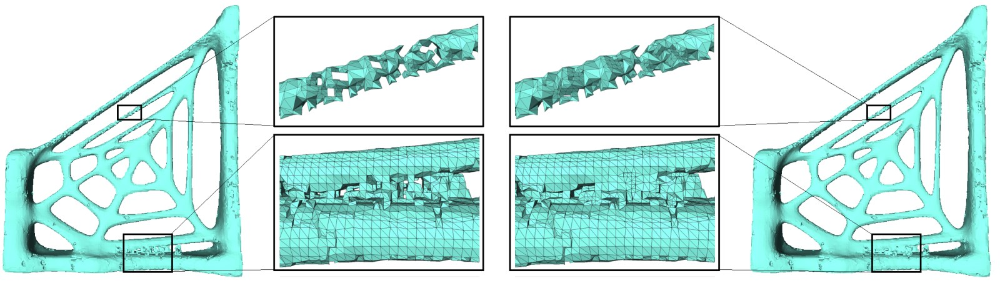

# TopoMender

Automatic topology repair and editing of 3D models.

## Introduction

TopoMender is the research project I developed at Tsinghua University a long time ago. The technique is based on the following papers:

Topology Repair of Solid Models Using Skeletons  
Qian-Yi Zhou, Tao Ju and Shi-Min Hu  
IEEE TVCG 2007

Editing The Topology of 3D Models by Sketching  
Tao Ju, Qian-Yi Zhou and Shi-Min Hu  
SIGGRAPH 2007

## Usage

The project is ancient. I am not intending to provide support. You are at your own risk.

Executables and testing data can be found on [my homepage](http://qianyi.info/topomender.html). The executables run on Windows platform. If you work on Linux or OS X, [Wine](https://www.winehq.org/) may help you. You will need to setup [PolyMender from Prof. Tao Ju](http://www1.cse.wustl.edu/~taoju/code/polymender.htm) as it is a prerequisite of TopoMender.

This repository includes source code of the two projects.

* [TopoMender](TopoMender) is the code for topology repair (the first paper). The input includes a volume data file scan-converted by PolyMender, and two parameters indicating the size of the thinnest handle and the smallest hole allowed. The output is a PLY mesh file.

* [TopoMender_MendIT](TopoMender_MendIT) is the TopoMender version of the MendIT project (the second paper, without GUI). The input includes a volume data file provided by PolyMender, and a .axs skeleton file (the format is straightforward, you can read [Skeleton.cpp](TopoMender_MendIT/Skeleton.cpp) to see how it is parsed). The output is a PLY mesh file. The output model is guaranteed to have the same topology as the given skeleton.

## Compilation

The two projects should be both compilable with Visual Studio. I developed them with Visual Studio 2005. A modern [Visual Studio](https://www.visualstudio.com/) *should* be able to convert the project into a modern format and compile it.

There might be some OpenGL or GUI related code that causes compilation problems. However, TopoMender is a pure console program. The GUI part is introduced for visualization and debugging purpose only. If it causes problem, just remove it.

## License

The source code is released under the MIT license. You can do anything with the code with proper attribution. I developed these projects in hope they will be useful. Please let me ([Qianyi.Zhou@gmail.com](mailto:Qianyi.Zhou@gmail.com)) know if you are doing anything interesting with it.

See [LICENSE](LICENSE) file for details.

## Help Wanted

The code is in good shape, and I believe it is still useful somewhere. However, I do not have the bandwidth to maintain this project. If you are willing to contribute, [contact me](mailto:Qianyi.Zhou@gmail.com), or submit [issues](https://github.com/qianyizh/TopoMender/issues) and [pull requests](https://github.com/qianyizh/TopoMender/pulls).

The current most immediate enhancement is to migrate TopoMender into a CMake build system and make it cross-platform. Please contact me if you can provide help for this.
